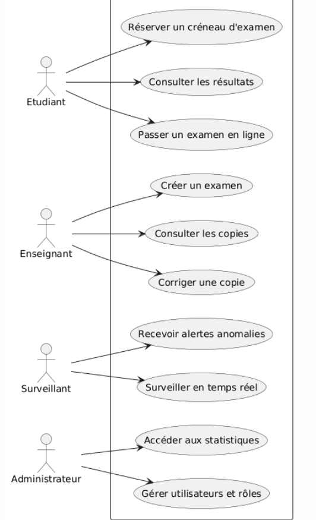
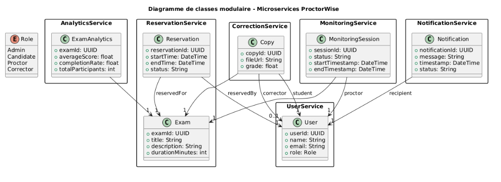
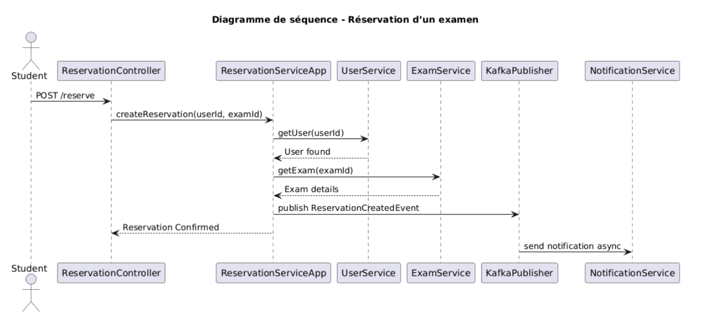
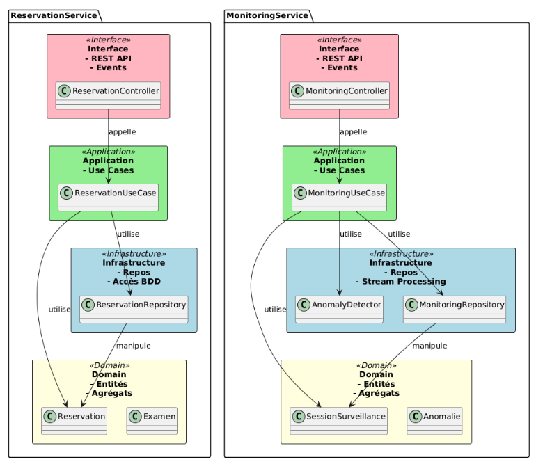
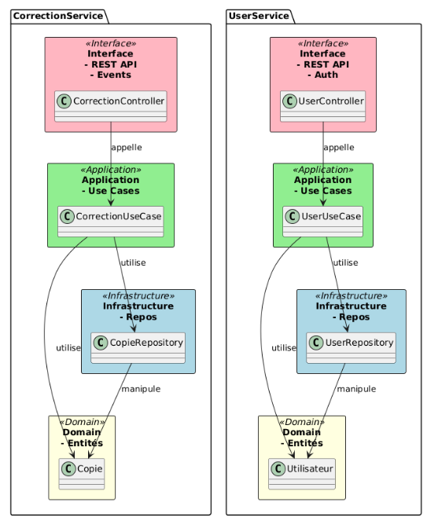
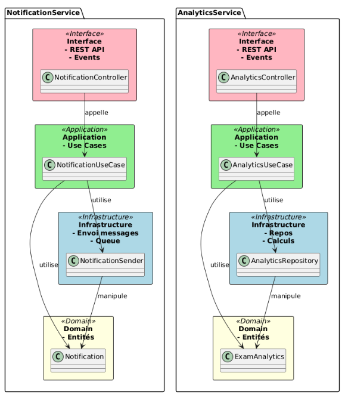
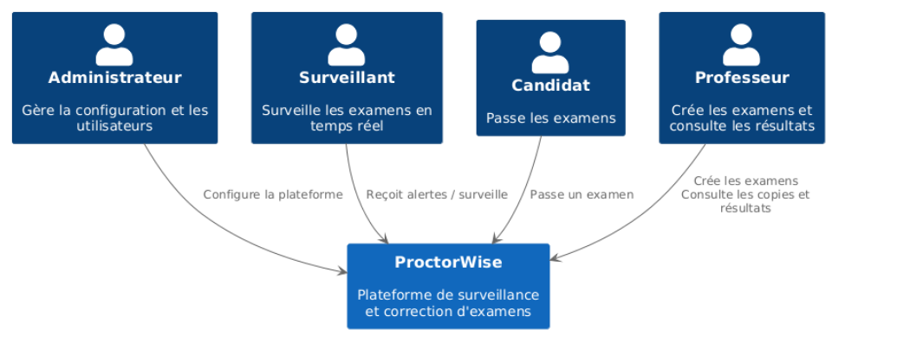
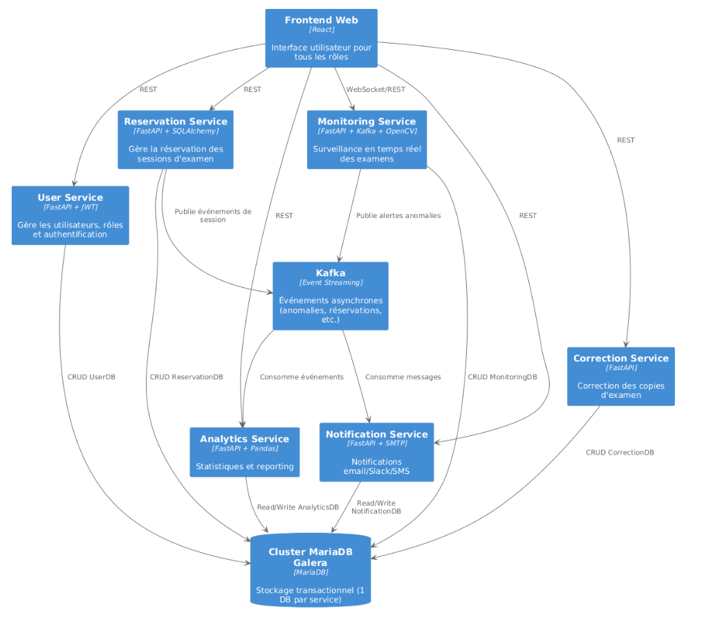
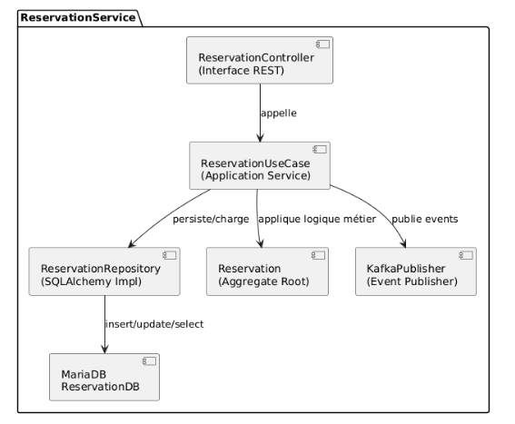

# Rapport Technique – ProctorWise

---

## 1. Contexte métier

ProctorWise est une plateforme destinée à organiser et surveiller des examens en ligne. Elle gère :

* La réservation des créneaux par les étudiants
* La surveillance automatique en temps réel avec détection d’anomalies
* La correction des copies et la gestion des notes
* Le reporting analytique

Ces fonctionnalités nécessitent une haute disponibilité, assurée notamment par un cluster **MariaDB Galera**.

L’architecture repose sur un ensemble de **microservices modulaires**, chacun correspondant à un **domaine métier autonome** et structuré selon la **Clean Architecture**. La communication entre services utilise **REST** pour les opérations synchrones et **Kafka** pour les échanges asynchrones.

**Objectifs principaux** : scalabilité, résilience, maintenabilité, flexibilité technologique.

---

## 2. Architecture globale

### Microservices modulaires

Chaque service couvre un **Bounded Context** (contexte borné) défini selon DDD, limitant les dépendances et facilitant la maintenance.

### Clean Architecture interne

* **Domaine** : règles métier pures
* **Application** : orchestration des cas d’usage
* **Infrastructure** : gestion de la persistance, des événements, de la communication
* **Interface** : exposition des API REST

### Communication

* **REST** : opérations synchrones (par exemple : création, consultation, mise à jour)
* **Kafka** : événements asynchrones (par exemple : alertes, notifications)

### Cluster MariaDB Galera

* Réplication synchrone **multi-maître**
* Haute disponibilité et cohérence des données

### Avantages

* Scalabilité ciblée
* Déploiement indépendant
* Résilience améliorée

---

## 3. Diagrammes

### 3.1 Diagramme de cas d’utilisation



### 3.2 Diagramme de classes modulaire




### 3.3 Diagramme de séquence – Création d'une réservation



### 3.4 Context map (bounded context)






### 3.5 Vues C4 (extraits)

* **C1 – Vue système** : 


* **C2 – Conteneurs** : 


* **C3 – Composants** : 



---

## 4. Détail des services

### 4.1 UserService

```
userservice/
├── main.py
├── requirements.txt
├── domain/
│   └── entities/
│       └── user.py
├── application/
│   ├── use_cases/
│   │   ├── register_user.py
│   │   └── get_user.py
│   └── interfaces/
│       └── user_repository.py
├── infrastructure/
│   ├── repositories/
│   │   └── sqlalchemy_user_repository.py
│   ├── database/
│   │   ├── models.py
│   │   └── mariadb_cluster.py
├── interface/
│   └── api/
│       ├── controllers/
│       │   └── user_controller.py
│       └── schemas/
│           ├── user_request.py
│           └── user_response.py
```

### 4.2 ReservationService

```
reservationservice/
├── main.py
├── requirements.txt
├── domain/
│   └── entities/
│       ├── reservation.py
│       └── exam.py
├── application/
│   ├── use_cases/
│   │   ├── create_reservation.py
│   │   ├── cancel_reservation.py
│   │   └── list_reservations.py
│   └── interfaces/
│       ├── reservation_repository.py
│       └── event_publisher.py
├── infrastructure/
│   ├── repositories/
│   │   └── sqlalchemy_reservation_repository.py
│   ├── events/
│   │   ├── kafka_publisher.py
│   │   └── kafka_consumer.py
│   └── database/
│       ├── models.py
│       └── mariadb_cluster.py
├── interface/
│   └── api/
│       ├── controllers/
│       │   └── reservation_controller.py
│       └── schemas/
│           ├── reservation_request.py
│           └── reservation_response.py
```

---

## 5. Justification des choix architecturaux

* **Microservices** : découpage métier clair, déploiement indépendant, résilience
* **Clean Architecture** : séparation des responsabilités, testabilité, découplage des dépendances
* **MariaDB Galera** : cohérence forte, réplication synchrone, haute disponibilité
* **Kafka** : communication asynchrone, découplage, robustesse
* **REST + Kafka** : simplicité des appels directs, efficacité des traitements événementiels

---

## 6. Bonnes pratiques appliquées : SOLID, KISS, DDD, TDD

* **SOLID** : responsabilités uniques, interfaces explicites, extensibilité facilitée
* **KISS** : simplicité, nommage clair, structure modulaire
* **DDD** : chaque service respecte un contexte borné
* **TDD** : cas d’usage testés unitairement, logique métier isolée pour les tests

---

## 7. MariaDB Galera & gestion du basculement

* Configuration **multi-maître**, réplication **synchrone**
* Tests de basculement réussis (arrêt d’un nœud sans perte de service)
* Connexion via SQLAlchemy avec **reconnexion automatique**
* Haute disponibilité assurée 24h/24, 7j/7

---

## 8. Conclusion

Cette architecture modulaire et robuste répond aux exigences métier en matière de :

* Haute disponibilité
* Scalabilité
* Résilience des traitements

Elle repose sur des standards éprouvés et une structuration claire, garantissant maintenabilité et évolutivité pour la plateforme ProctorWise.

---
